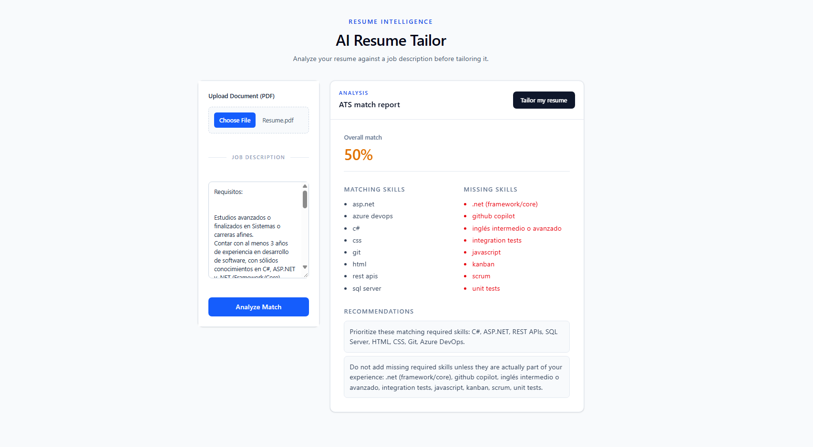

# Resume Tailor

Resume Tailor is a full-stack application that analyzes a resume against a job description and generates a tailored, ATS-friendly resume. It combines a React and TypeScript interface with a FastAPI service, document parsing, structured matching, factuality validation, and Azure OpenAI-powered tailoring.


## Demo Preview


## Why this project

The application focuses on a practical job-search workflow:

1. Upload a resume and provide a job description.
2. Compare the candidate profile with the role requirements.
3. Review matched skills, gaps, and recommendations.
4. Generate and download a tailored resume as PDF.

The tailoring pipeline is designed to preserve factual information rather than inventing experience. The backend separates extraction, matching, tailoring, document rendering, and validation into focused services.

## Tech Stack

* **Backend:** Python, FastAPI, Pydantic (Data Validation)
* **Frontend:** React 19, TypeScript, Vite, Tailwind CSS 
* **AI & NLP:** Azure OpenAI integration for profile extraction and resume tailoring
* **Deployment & Tooling:** Docker, Uvicorn

## Prerequisites

- Python 3.12+
- Node.js 20+
- `uv` for Python dependency management
- Azure OpenAI resource and deployment for AI-powered extraction and tailoring
- Docker and Docker Compose, if using the containerized workflow

## Configuration

Create a `.env` file in the repository root:

```dotenv
AZURE_OPENAI_ENDPOINT=https://<resource>.openai.azure.com/
AZURE_OPENAI_API_KEY=<your-api-key>
AZURE_OPENAI_DEPLOYMENT=<deployment-name>
```

Do not commit `.env` or API keys. The API reads these variables when an AI-backed operation is requested.

## Run with Docker Compose

From the repository root:

```bash
docker compose up --build
```

Then open:

- Frontend: http://localhost:5173
- API: http://localhost:8000
- API docs: http://localhost:8000/docs
- Health check: http://localhost:8000/health

## Run locally

### Backend

```bash
cd server
uv sync
uv run uvicorn app.main:app --reload --host 0.0.0.0 --port 8000
```

### Frontend

In a second terminal:

```bash
cd client
npm install
npm run dev
```

The Vite development server uses `http://localhost:8000` as its API target by default. Set `VITE_API_URL` when the backend runs elsewhere.

## API overview

| Method | Endpoint | Purpose |
| --- | --- | --- |
| `GET` | `/health` | Check API availability |
| `POST` | `/analyze` | Analyze a resume against job requirements |
| `POST` | `/extract` | Extract a resume profile or job requirements from an uploaded document |
| `POST` | `/tailor` | Generate a tailored Markdown or PDF resume |

Interactive OpenAPI documentation is available at `/docs` while the API is running.

Supported document inputs are currently:

- Resume: PDF
- Job description: TXT

The analyze and tailor endpoints can also accept structured profile and requirement data through form fields, which makes the service usable independently of the web interface.

## Tests and quality checks

Run the backend test suite:

```bash
cd server
uv run pytest
```

Run frontend type checking, production build, and linting:

```bash
cd client
npm run build
npm run lint
```

## Project status

This is an actively developed portfolio project. The core analyze-and-tailor workflow is implemented, with the backend structured to support additional input formats, matching strategies, and output templates over time.
